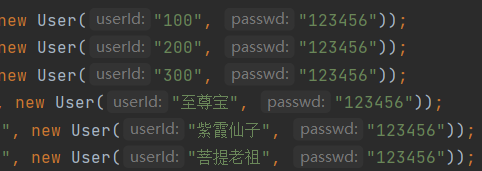

# qqdaoban

登录：
alidUser.put("100", new User("100", "123456"));
validUser.put("200", new User("200", "123456"));
validUser.put("300", new User("300", "123456"));
validUser.put("至尊宝", new User("至尊宝", "123456"));
validUser.put("紫霞仙子", new User("紫霞仙子", "123456"));
validUser.put("菩提老祖", new User("菩提老祖", "123456"));
两个实现了可以相互离线发送消息和文件的用户：
offlineDb.put("100", user100Db);
offlineDb.put("200", user200Db);
 
